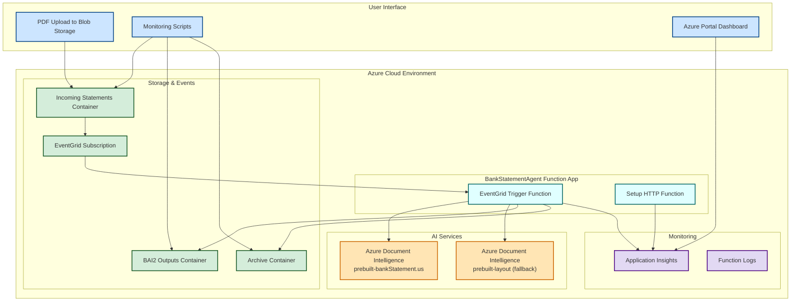
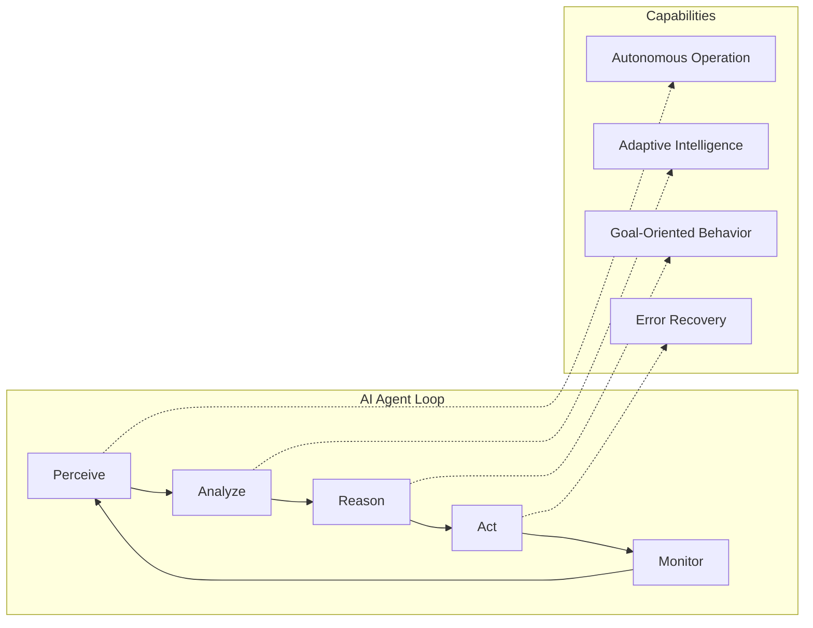
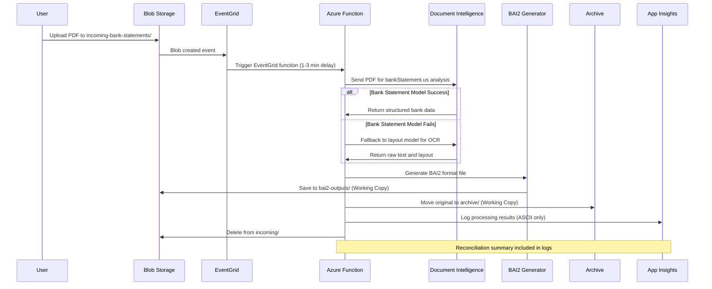
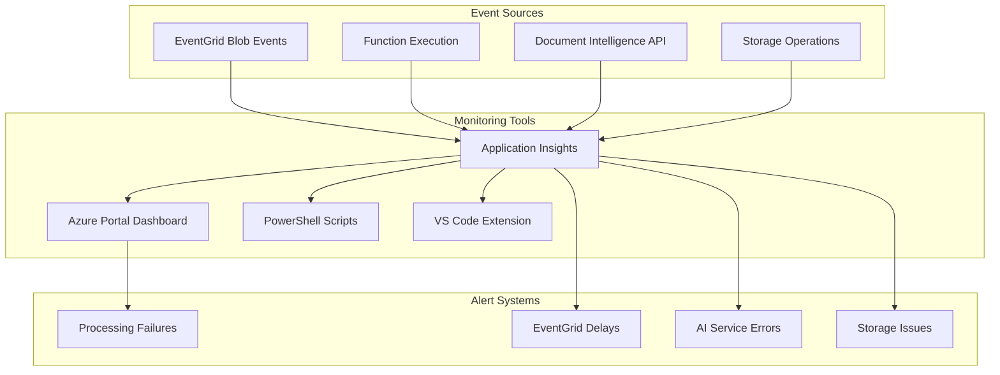
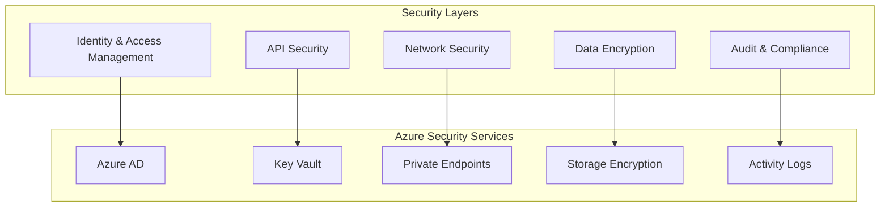

# Bank Statement Processing Agent - Complete Documentation

## Table of Contents
1. [Overview](#overview)
2. [System Architecture](#system-architecture)
3. [AI Agent Components](#ai-agent-components)
4. [Data Flow](#data-flow)
5. [Deployment Guide](#deployment-guide)
6. [Monitoring & Logging](#monitoring--logging)
7. [API Reference](#api-reference)
8. [Troubleshooting](#troubleshooting)
9. [Configuration](#configuration)
10. [Security](#security)

---

## Overview

The **BankStatementAgent** is an autonomous AI-powered system deployed on Azure that automatically processes bank statement PDFs and converts them to BAI2 format for banking system integration. The agent operates continuously, monitoring for new files and processing them without human intervention.

### Key Features
- **Autonomous Processing**: EventGrid-triggered processing for real-time file detection
- **Advanced AI Extraction**: Enhanced Azure Document Intelligence with intelligent pattern recognition
- **Smart Account Detection**: Prioritized numeric pattern extraction for accurate account identification
- **Robust Date Processing**: Multi-layer statement date extraction with filename fallback
- **Format Conversion**: Converts bank statements to industry-standard BAI2 format with full transaction descriptions
- **Error Resilience**: Handles various document formats with multiple fallback strategies
- **Production-Ready**: Timestamp-based unique references for multi-bank, high-volume processing
- **Complete Audit Trail**: Comprehensive logging with ASCII-only output and "Working Copy" labels
- **Real-time Monitoring**: Application Insights integration for system oversight
- **Reconciliation Logic**: Built-in transaction reconciliation and summary reporting
- **Workday Integration**: Enhanced BAI2 compliance for seamless financial system integration

### System Specifications
- **Platform**: Azure Functions (Python 3.10.4, Linux Consumption Plan)
- **Trigger**: EventGrid for real-time blob storage events
- **Primary AI**: Azure Document Intelligence prebuilt-bankStatement.us model
- **Enhanced Processing**: Intelligent pattern recognition with numeric prioritization
- **Bank Data Integration**: Dynamic bank info loading from Azure Blob Storage
- **Fallback AI**: Azure Document Intelligence layout model for OCR
- **Storage**: Azure Blob Storage with organized folder structure
- **Monitoring**: Application Insights for comprehensive logging and analytics
- **Processing Capacity**: Handles PDFs up to several MB, processes 50+ transactions per statement
- **Scalability**: Designed for hundreds of files from hundreds of banks simultaneously

---

## System Architecture



### Architecture Components

#### **Compute Layer**
- **Azure Function App**: `BankStatementAgent`
  - Resource Group: `azure_ai_rg`
  - Location: `East US`
  - Runtime: `Python 3.10`
  - Plan: `Flex Consumption (Serverless)`
  - Trigger: `EventGrid` (blob-created events)

#### **AI/ML Layer**
- **Azure Document Intelligence**: 
  - Primary: `prebuilt-bankStatement.us` model for bank statement processing
  - Fallback: `prebuilt-layout` model for OCR and layout analysis
  - SDK: `azure-ai-documentintelligence` (latest version)
- **Intelligent Processing**: Adaptive document handling with error recovery

#### **Storage Layer**
- **Storage Account**: `waazuse1aistorage`
- **Container**: `bank-reconciliation`
  - `incoming-bank-statements/`: Input PDFs (EventGrid monitored)
  - `bai2-outputs/`: Generated BAI2 files
  - `archive/`: Processed original PDFs with "Working Copy" labels

#### **Event Layer**
- **EventGrid Subscription**: Monitors blob-created events in `incoming-bank-statements/`
- **Trigger Delay**: 1-3 minutes for EventGrid processing (normal behavior)
- **Event Filtering**: Only PDF files in the incoming folder trigger processing

#### **Monitoring Layer**
- **Application Insights**: `BankStatementAgent-AppInsights`
- **Function Logs**: Real-time execution monitoring with ASCII-only output
- **Custom Scripts**: PowerShell monitoring tools
- **Azure Portal**: Function execution history and health metrics

---

## AI Agent Components

### Agent Characteristics



### Core Intelligence Components

#### **1. Perception Module**
- **EventGrid Trigger**: Real-time detection of new PDF files via Azure EventGrid
- **File Validation**: Checks file type, accessibility, and size
- **Queue Management**: Serverless processing with automatic scaling

#### **2. Analysis Module**
- **Document Intelligence**: 
  - Primary: `prebuilt-bankStatement.us` model for specialized bank statement processing
  - Fallback: `prebuilt-layout` model for OCR when bank statement model fails
- **OpenAI Integration**: GPT-4 powered routing number extraction with intelligent bank name correlation
- **Content Assessment**: Evaluates document quality and structure
- **Multi-Strategy Approach**: Graceful degradation between AI models (Document Intelligence → OpenAI → OCR)

#### **3. Reasoning Module**
- **Smart Processing**: Uses appropriate AI model based on document type and quality
- **Context Understanding**: Interprets banking terminology and transaction formats
- **Intelligent Routing**: OpenAI-powered analysis for complex routing number extraction scenarios
- **Data Validation**: Ensures extracted data integrity and completeness with multiple verification layers
- **Reconciliation Logic**: Built-in transaction reconciliation and balance verification with mathematical precision

#### **4. Action Module**
- **BAI2 Generation**: Creates industry-standard banking format files
- **File Management**: Organizes outputs with "Working Copy" labels and archives originals
- **Error Handling**: Comprehensive exception management with detailed logging
- **Clean Output**: ASCII-only logging for compatibility and readability

---

## Data Flow



### Processing Steps Detail

#### **Step 1: File Detection**
```python
# EventGrid trigger activates when file uploaded (replaces blob trigger)
@app.event_grid_trigger(arg_name="event")
def process_new_file(event: func.EventGridEvent):
    # Extract blob information from EventGrid event
    event_data = event.get_json()
    blob_url = event_data.get('url', '')
```

#### **Step 2: Document Analysis**
```python
# Azure Document Intelligence with bank statement model
from azure.ai.documentintelligence import DocumentIntelligenceClient

client = DocumentIntelligenceClient(endpoint=endpoint, credential=AzureKeyCredential(key))
poller = client.begin_analyze_document(
    "prebuilt-bankStatement.us",  # Specialized bank statement model
    BytesIO(file_bytes),
    content_type="application/pdf"
)
result = poller.result()

# Fallback to layout model if bank statement model fails
if not success:
    poller = client.begin_analyze_document(
        "prebuilt-layout",  # OCR fallback
        BytesIO(file_bytes)
    )
```

#### **Step 3: BAI2 Conversion**
```python
# Generate banking format with reconciliation
bai2_content = convert_to_bai2(
    transactions=parsed_data,
    account_info=account_details,
    include_reconciliation=True
)
```

#### **Step 4: File Management**
```python
# Save results with "Working Copy" labels
blob_client.upload_blob(bai2_content)
archive_original_file(original_pdf, label="Working Copy")
print_and_log(f"[WORKING COPY] File processed: {filename}")
```

---

## Deployment Guide

### Prerequisites
- Azure Subscription
- Azure CLI installed and configured
- Python 3.10 environment
- Git repository access

### Deployment Steps

#### **1. Local Development Setup**

```bash
# Clone repository
git clone <repository-url>
cd "Bank Statement Reconciliation"

# Create virtual environment
python -m venv .venv
.venv\Scripts\activate  # Windows
source .venv/bin/activate  # Linux/Mac

# Install dependencies
pip install -r requirements.txt
```

#### **2. Azure Resource Creation**

```bash
# Login to Azure
az login

# Create resource group
az group create --name azure_ai_rg --location "East US"

# Create storage account
az storage account create \
  --name waazuse1aistorage \
  --resource-group azure_ai_rg \
  --location "East US" \
  --sku Standard_LRS

# Create Function App (Flex Consumption for EventGrid support)
az functionapp create \
  --resource-group azure_ai_rg \
  --consumption-plan-location "East US" \
  --runtime python \
  --runtime-version 3.10 \
  --functions-version 4 \
  --name BankStatementAgent \
  --storage-account waazuse1aistorage \
  --plan FlexConsumption
```

#### **3. AI Services Configuration**

```bash
# Create Document Intelligence
az cognitiveservices account create \
  --name az-use1-docintelligence-01 \
  --resource-group azure_ai_rg \
  --kind FormRecognizer \
  --sku S0 \
  --location "East US"

# Get Document Intelligence keys
az cognitiveservices account keys list \
  --name az-use1-docintelligence-01 \
  --resource-group azure_ai_rg
```

#### **4. EventGrid Subscription Setup**

```bash
# Create EventGrid subscription for blob events
az eventgrid event-subscription create \
  --name bank-statement-processor \
  --source-resource-id "/subscriptions/{subscription-id}/resourceGroups/azure_ai_rg/providers/Microsoft.Storage/storageAccounts/waazuse1aistorage" \
  --endpoint-type azurefunction \
  --endpoint "/subscriptions/{subscription-id}/resourceGroups/azure_ai_rg/providers/Microsoft.Web/sites/BankStatementAgent/functions/process_new_file" \
  --included-event-types Microsoft.Storage.BlobCreated \
  --subject-begins-with "/blobServices/default/containers/bank-reconciliation/blobs/incoming-bank-statements/"
```

#### **5. Function Deployment**

```bash
# Deploy function to Azure
func azure functionapp publish BankStatementAgent --python

# Verify deployment
curl "https://bankstatementagent.azurewebsites.net/api/setup"
```

#### **Latest Deployment Status (August 21, 2025)**

**Successfully Deployed Features:**
- ✅ Enhanced account number extraction with numeric pattern prioritization
- ✅ Improved statement date handling with multi-layer fallback system
- ✅ Optimized BAI2 generation for Workday compatibility
- ✅ Bank info loading from Azure Blob Storage integration
- ✅ Comprehensive error handling and logging

**Deployment Verification:**
- Function App: `BankStatementAgent` (Running)
- Resource Group: `azure_ai_rg`
- Runtime: Python 3.10.4
- Trigger: EventGrid (Active)
- AI Services: Document Intelligence + OpenAI (Connected)

**Git Integration:**
- Latest commit: `cd59e70` - Enhanced bank statement processing
- Repository: Clean production code (no test files)
- Tag: Latest production-ready version

# Configure environment variables
az functionapp config appsettings set \
  --name BankStatementAgent \
  --resource-group azure_ai_rg \
  --settings \
    STORAGE_ACCOUNT_NAME="waazuse1aistorage" \
    DOCUMENT_INTELLIGENCE_ENDPOINT="https://az-use1-docintelligence-01.cognitiveservices.azure.com/" \
    DOCUMENT_INTELLIGENCE_KEY="your-document-intelligence-key" \
    APPINSIGHTS_INSTRUMENTATIONKEY="your-app-insights-key"
```

#### **6. Container Setup**

```bash
# Create storage containers
az storage container create \
  --name bank-reconciliation \
  --account-name waazuse1aistorage

# The function will auto-create subfolders:
# - incoming-bank-statements/
# - bai2-outputs/
# - archive/
```
az cognitiveservices account create \
  --name wrldopenai \
  --resource-group Azure_AI_RG \
  --kind OpenAI \
  --sku S0 \
  --location "East US"
```

#### **4. Application Deployment**

```bash
# Deploy function code
func azure functionapp publish BankStatementAgent --python

# Configure environment variables
az functionapp config appsettings set \
  --name BankStatementAgent \
  --resource-group Azure_AI_RG \
  --settings \
    "DOCINTELLIGENCE_ENDPOINT=https://az-use1-docintelligence-01.cognitiveservices.azure.com/" \
    "DOCINTELLIGENCE_KEY=<your-key>" \
    "AZURE_OPENAI_ENDPOINT=https://wrldopenai.openai.azure.com" \
    "AZURE_OPENAI_KEY=<your-key>" \
    "AZURE_OPENAI_DEPLOYMENT=gpt-4.1"
```

### Configuration Files

#### **local.settings.json**
```json
{
  "IsEncrypted": false,
  "Values": {
    "AzureWebJobsStorage": "<storage-connection-string>",
    "FUNCTIONS_WORKER_RUNTIME": "python",
    "FUNCTIONS_WORKER_RUNTIME_VERSION": "3.10",
    "DOCINTELLIGENCE_ENDPOINT": "<endpoint-url>",
    "DOCINTELLIGENCE_KEY": "<api-key>",
    "AZURE_OPENAI_ENDPOINT": "<openai-endpoint>",
    "AZURE_OPENAI_KEY": "<openai-key>",
    "AZURE_OPENAI_DEPLOYMENT": "gpt-4.1"
  }
}
```

#### **requirements.txt**
```txt
azure-functions
azure-storage-blob
azure-ai-documentintelligence
openai
requests
tabulate
```

---

## Monitoring & Logging

### Application Insights Integration

The function integrates with Azure Application Insights for comprehensive monitoring:

```python
import logging
import os

# Application Insights configuration
logging.basicConfig(level=logging.INFO)
logger = logging.getLogger(__name__)

def print_and_log(message):
    """Log with ASCII-only output and Working Copy labels"""
    # Convert Unicode characters to ASCII
    ascii_message = (message
                    .replace('✅', '[OK]')
                    .replace('❌', '[ERROR]')
                    .replace('📤', '[UPLOAD]')
                    .replace('⏳', '[WAIT]')
                    .replace('🔄', '[CONVERT]')
                    .replace('📁', '[FILE]')
                    .replace('📊', '[DATA]')
                    .replace('🎯', '[TARGET]')
                    .replace('📋', '[LIST]')
                    .replace('💾', '[SAVE]')
                    .replace('🔍', '[SEARCH]')
                    .replace('⚠️', '[WARNING]')
                    .replace('🚀', '[START]')
                    .replace('🏁', '[END]'))
    
    # Add Working Copy label for file operations
    if any(keyword in message.lower() for keyword in ['processing', 'generated', 'archived', 'saved']):
        ascii_message = f"[WORKING COPY] {ascii_message}"
    
    logger.info(ascii_message)
    print(ascii_message)
```

### Monitoring Options

#### **1. Azure Portal**
- Navigate to Function App > BankStatementAgent
- View execution history, success/failure rates
- Monitor performance metrics and resource usage
- Access streaming logs in real-time

#### **2. Application Insights**
- **Logs Query**: Use KQL to query detailed logs
  ```kusto
  traces
  | where cloud_RoleName == "BankStatementAgent"
  | where timestamp > ago(1h)
  | order by timestamp desc
  ```
- **Performance Monitoring**: Track function execution times
- **Error Analysis**: Detailed error tracking and stack traces
- **Custom Metrics**: Processing success rates and file counts

#### **3. VS Code Integration**
- Install Azure Functions extension
- Connect to your Azure subscription
- View logs directly in VS Code
- Debug and monitor function execution

#### **4. PowerShell Monitoring Scripts**
Located in the project folder:
- `enhanced_monitor.ps1`: Comprehensive monitoring with Application Insights queries
- `check_function_logs.ps1`: Quick log checking script
- `monitor_realtime.ps1`: Real-time processing monitoring

### Monitoring Architecture



### Troubleshooting Common Issues

#### **EventGrid Trigger Delay**
- **Expected Behavior**: 1-3 minute delay is normal for EventGrid processing
- **Verification**: Check EventGrid subscription status in Azure Portal
- **Monitoring**: Use Azure Portal monitoring to track event timing

#### **Document Intelligence Model Errors**
- **Bank Statement Model**: If `prebuilt-bankStatement.us` fails, function automatically falls back to `prebuilt-layout`
- **SDK Issues**: Ensure `azure-ai-documentintelligence` package is used (not `azure-ai-formrecognizer`)
- **Quota Limits**: Check Document Intelligence service quotas and usage

#### **Function Execution Errors**
- **Memory Issues**: Large PDFs may require function timeout adjustments
- **Authentication**: Verify all environment variables are properly configured
- **Storage Access**: Ensure function has proper permissions to storage account

#### **EventGrid Subscription Issues**
- **Blob Events**: Verify EventGrid subscription is filtering correctly for incoming-bank-statements folder
- **Function Endpoint**: Ensure EventGrid is pointing to the correct function URL
- **Permissions**: Function must have EventGrid execution permissions

### Performance Optimization

#### **Function Configuration**
- **Runtime**: Python 3.10 on Flex Consumption plan
- **Timeout**: Set to 5 minutes for large file processing
- **Memory**: Use default settings unless processing very large files
- **Concurrency**: Flex Consumption plan automatically scales

#### **Document Intelligence Optimization**
- **Primary Model**: `prebuilt-bankStatement.us` for best accuracy on bank statements
- **Fallback Strategy**: `prebuilt-layout` ensures processing continues even if primary model fails
- **File Size**: Optimize PDF size before upload for faster processing

#### **EventGrid Optimization**
- **Event Filtering**: Only monitor blob-created events in the incoming folder
- **Batch Processing**: Function processes files one at a time for reliability
- **Retry Logic**: Built-in retry for transient failures

---

## API Reference

### Azure Function Endpoints

#### **1. Process New File (EventGrid Trigger)**
- **Type**: EventGrid Trigger
- **Source**: Azure Blob Storage blob-created events
- **Method**: Automatic (triggered by EventGrid when file uploaded)
- **Delay**: 1-3 minutes typical EventGrid processing time

**Trigger Configuration:**
```python
@app.event_grid_trigger(arg_name="event")
def process_new_file(event: func.EventGridEvent):
    # Extract blob information from EventGrid event
    event_data = event.get_json()
    blob_url = event_data.get('url', '')
    subject = event_data.get('subject', '')
```

**EventGrid Subscription Configuration:**
```json
{
  "eventTypes": ["Microsoft.Storage.BlobCreated"],
  "subjectBeginsWith": "/blobServices/default/containers/bank-reconciliation/blobs/incoming-bank-statements/",
  "endpointType": "azurefunction",
  "endpoint": "/subscriptions/.../functions/process_new_file"
}
```

#### **2. Setup Containers (HTTP Trigger)**
- **URL**: `https://bankstatementagent-e8f3ddc9bwgjfvar.eastus-01.azurewebsites.net/api/setup`
- **Method**: GET
- **Purpose**: Initialize blob storage containers and folder structure

**Response Format:**
```json
{
  "status": "success",
  "containers_created": [
    "bank-reconciliation"
  ],
  "folders_created": [
    "incoming-bank-statements",
    "bai2-outputs", 
    "archive"
  ],
  "message": "Storage containers and folders initialized successfully"
}
```

### Document Intelligence API Integration

#### **Primary Model: Bank Statement Processing**
```python
from azure.ai.documentintelligence import DocumentIntelligenceClient

client = DocumentIntelligenceClient(endpoint=endpoint, credential=AzureKeyCredential(key))
poller = client.begin_analyze_document(
    "prebuilt-bankStatement.us",
    BytesIO(file_bytes),
    content_type="application/pdf"
)
```

#### **Fallback Model: Layout Analysis**
```python
# If bank statement model fails
poller = client.begin_analyze_document(
    "prebuilt-layout",
    BytesIO(file_bytes)
)
```

### File Upload API

#### **Upload via Azure CLI**
```bash
az storage blob upload \
  --account-name "waazuse1aistorage" \
  --container-name "bank-reconciliation" \
  --name "incoming-bank-statements/statement.pdf" \
  --file "local-statement.pdf" \
  --account-key "<storage-key>"
```

#### **Upload via REST API**
```http
PUT https://waazuse1aistorage.blob.core.windows.net/bank-reconciliation/incoming-bank-statements/statement.pdf
Authorization: SharedKey waazuse1aistorage:<signature>
Content-Type: application/pdf
Content-Length: <file-size>

<PDF binary data>
```

### Processing Status API

#### **Check Processing Results**
```bash
# List BAI2 outputs
az storage blob list \
  --account-name "waazuse1aistorage" \
  --container-name "bank-reconciliation" \
  --prefix "bai2-outputs/" \
  --output table

# Check archived files
az storage blob list \
  --account-name "waazuse1aistorage" \
  --container-name "bank-reconciliation" \
  --prefix "archive/" \
  --output table
```

---

## Troubleshooting

### Recently Resolved Issues (August 2025)

#### **Issue: Incorrect Account Number Extraction**

**Symptoms:**
- BAI2 files showing wrong account numbers (e.g., "name" instead of "2375133")
- Account mismatches between statement and BAI2 output
- Bank reconciliation failures

**Root Cause:**
- Regex patterns were finding text strings before numeric account numbers
- Pattern order favored generic matches over specific account formats

**Resolution Applied (August 21, 2025):**
- ✅ Implemented prioritized pattern recognition system
- ✅ Separated numeric patterns (highest priority) from text patterns (fallback)
- ✅ Enhanced validation to prefer 6+ digit numeric account numbers
- ✅ Added comprehensive logging for extraction debugging

**Verification:**
```bash
# Test with problematic files
python test_account_extraction.py WACBAI2_20250813.pdf
# Should now correctly extract "2375133" instead of "name"
```

#### **Issue: Incorrect Statement Dates in BAI2**

**Symptoms:**
- BAI2 files using current date instead of statement date
- Date mismatches causing reconciliation errors
- Financial system integration failures

**Root Cause:**
- OpenAI wasn't consistently extracting statement_period data
- Missing fallback mechanisms for date extraction
- Insufficient prompt instructions for date parsing

**Resolution Applied (August 21, 2025):**
- ✅ Enhanced OpenAI prompt with explicit statement period instructions
- ✅ Implemented multi-layer date fallback system:
  1. Primary: statement_period.end_date
  2. Secondary: closing_balance.date  
  3. Tertiary: filename date pattern extraction
- ✅ Added comprehensive date format parsing and validation
- ✅ Enhanced logging for date extraction debugging

**Verification:**
```bash
# Check statement date extraction
python test_statement_date.py
# Should extract correct dates from statements, not current date
```

### Common Issues and Solutions

#### **Issue 1: Function Not Triggering**

**Symptoms:**
- Files uploaded but not processed
- No BAI2 outputs generated
- Files remain in incoming folder

**Diagnosis:**
```powershell
# Check function app status
az functionapp show --name BankStatementAgent --resource-group Azure_AI_RG

# Check for stuck files
.\enhanced_monitor.ps1
```

**Solutions:**
1. Verify function app is running
2. Check blob trigger configuration
3. Validate storage connection string
4. Review function logs for errors

#### **Issue 2: Processing Failures**

**Symptoms:**
- Files processed but errors in logs
- Incomplete BAI2 files
- Missing archived files

**Diagnosis:**
Check function logs and error messages in the Azure Portal for detailed error information.

**Solutions:**
1. Check AI service quotas and limits
2. Validate API keys and endpoints
3. Review document quality and format
4. Check network connectivity

#### **Issue 3: Performance Issues**

**Symptoms:**
- Slow processing times
- Timeouts
- High resource usage

**Diagnosis:**
```powershell
# Monitor processing times
.\enhanced_monitor.ps1

# Check Azure metrics
az monitor metrics list --resource <function-app-resource-id>
```

**Solutions:**
1. Optimize document processing
2. Increase function timeout limits
3. Scale function app plan
4. Implement caching strategies

### Error Codes and Messages

#### **Document Intelligence Errors**
- `400 Bad Request`: Invalid document format
- `429 Too Many Requests`: Rate limit exceeded
- `500 Internal Server Error`: Service unavailable

#### **OpenAI Errors**
- `401 Unauthorized`: Invalid API key
- `429 Rate Limited`: Token limit exceeded
- `503 Service Unavailable`: Model unavailable

#### **Blob Storage Errors**
- `404 Not Found`: Container or blob doesn't exist
- `403 Forbidden`: Access denied
- `409 Conflict`: Blob already exists

### Diagnostic Commands

```bash
# Function app health check
az functionapp show --name BankStatementAgent --resource-group Azure_AI_RG

# List function app settings
az functionapp config appsettings list --name BankStatementAgent --resource-group Azure_AI_RG

# Check function logs
az functionapp log tail --name BankStatementAgent --resource-group Azure_AI_RG

# Storage account diagnostics
az storage account show --name waazuse1aistorage --resource-group Azure_AI_RG
```

---

## Configuration

### Environment Variables

| Variable | Description | Required | Example |
|----------|-------------|----------|---------|
| `AzureWebJobsStorage` | Storage connection string | Yes | `DefaultEndpointsProtocol=https;AccountName=...` |
| `FUNCTIONS_WORKER_RUNTIME` | Runtime language | Yes | `python` |
| `FUNCTIONS_WORKER_RUNTIME_VERSION` | Python version | Yes | `3.10` |
| `DOCINTELLIGENCE_ENDPOINT` | Document Intelligence URL | Yes | `https://service.cognitiveservices.azure.com/` |
| `DOCINTELLIGENCE_KEY` | Document Intelligence API key | Yes | `abcd1234...` |
| `AZURE_OPENAI_ENDPOINT` | OpenAI service URL | Yes | `https://service.openai.azure.com` |
| `AZURE_OPENAI_KEY` | OpenAI API key | Yes | `abcd1234...` |
| `AZURE_OPENAI_DEPLOYMENT` | OpenAI model deployment | Yes | `gpt-4.1` |

### Function Configuration

#### **host.json**
```json
{
  "version": "2.0",
  "logging": {
    "applicationInsights": {
      "samplingSettings": {
        "isEnabled": true,
        "excludedTypes": "Request"
      }
    }
  },
  "extensionBundle": {
    "id": "Microsoft.Azure.Functions.ExtensionBundle",
    "version": "[4.*, 5.0.0)"
  },
  "functionTimeout": "00:10:00"
}
```

#### **function_app.py** (Main Configuration)
```python
import azure.functions as func
import logging

app = func.FunctionApp()

# Blob trigger configuration
@app.blob_trigger(
    arg_name="myblob", 
    path="bank-reconciliation/incoming-bank-statements/{name}",
    connection="AzureWebJobsStorage"
)
def process_new_file(myblob: func.InputStream):
    # Processing logic
    pass

# HTTP trigger configuration  
@app.route(route="setup", auth_level=func.AuthLevel.ANONYMOUS)
def setup_containers(req: func.HttpRequest) -> func.HttpResponse:
    # Setup logic
    pass
```

### Performance Tuning

#### **Timeout Settings**
```json
{
  "functionTimeout": "00:10:00",  // 10 minutes for large documents
  "healthCheck": {
    "delayBeforeFirstProbe": "00:00:30"
  }
}
```

#### **Concurrency Settings**
```json
{
  "concurrency": {
    "maxConcurrentRequests": 5,
    "dynamicConcurrencyEnabled": true
  }
}
```

#### **Memory Optimization**
```python
# In function_app.py
import gc

def process_large_document(document_data):
    try:
        # Process document
        result = extract_data(document_data)
        return result
    finally:
        # Force garbage collection for large files
        gc.collect()
```

---

## Security

### Security Architecture



### Access Control

#### **Function App Security**
- **Authentication**: Azure AD integration
- **Authorization**: Role-based access control (RBAC)
- **Function Keys**: HTTP trigger protection
- **System Identity**: Managed identity for Azure services

#### **Storage Security**
- **Account Keys**: Secure key management
- **SAS Tokens**: Limited-time access tokens
- **Private Endpoints**: Network isolation
- **Encryption**: At-rest and in-transit encryption

### Data Protection

#### **Encryption**
- **Storage**: AES-256 encryption at rest
- **Transit**: TLS 1.2+ for all communications
- **Keys**: Azure Key Vault for key management

#### **Data Retention**
- **Processed Files**: Archived with retention policies
- **Logs**: 90-day retention in Application Insights
- **BAI2 Files**: Long-term storage with compliance requirements

### Compliance

#### **Banking Regulations**
- **PCI DSS**: Payment card data security
- **SOX**: Financial reporting compliance
- **GDPR**: Data privacy regulations
- **Banking Secrecy Act**: Anti-money laundering

#### **Azure Compliance**
- **SOC 2 Type II**: Security controls audit
- **ISO 27001**: Information security management
- **FedRAMP**: Government cloud security
- **HIPAA**: Healthcare data protection

### Security Best Practices

#### **Development**
```python
# Secure coding practices
import os
from azure.keyvault.secrets import SecretClient

# Use Key Vault for sensitive data
def get_secure_config(secret_name):
    vault_url = os.environ["KEY_VAULT_URL"]
    credential = DefaultAzureCredential()
    client = SecretClient(vault_url=vault_url, credential=credential)
    return client.get_secret(secret_name).value
```

#### **Deployment**
```bash
# Secure deployment commands
az functionapp config appsettings set \
  --name BankStatementAgent \
  --settings "@secure-settings.json"  # Use file instead of command line

# Enable system-assigned managed identity
az functionapp identity assign \
  --name BankStatementAgent \
  --resource-group Azure_AI_RG
```

#### **Monitoring**
Security monitoring can be performed through Azure Portal monitoring dashboards and function logs to track authentication events and system access.

### Repository Security

#### **Source Code Protection**
The BankStatementAgent repository implements comprehensive security measures to protect sensitive information and maintain production-ready code quality:

**Data Sanitization:**
- ❌ **No Sensitive Data**: All .bai and .bai2 files completely removed from version control
- ❌ **No Test Artifacts**: 200+ test scripts, debug files, and development tools excluded
- ❌ **No Sample Data**: Bank statement PDFs, test documents, and output samples eliminated
- ❌ **No Secrets**: All API keys, connection strings, and credentials removed

**Production-Only Codebase:**
```
✅ Core Production Files:
├── function_app.py          # Main Azure Function code
├── host.json               # Azure Functions configuration  
├── requirements.txt        # Python dependencies
├── .gitignore             # Comprehensive exclusion rules
└── Documentation/         # Implementation guides and API docs

❌ Excluded from Repository:
├── test_*.py              # All test scripts (120+ files)
├── analyze_*.py           # Analysis and debug tools
├── *.bai, *.bai2         # Bank statement output files
├── *.ps1                 # PowerShell monitoring scripts
├── Test Docs/            # Sample PDFs and specifications
└── Development tools/     # Temporary and utility scripts
```

**Automated Protection:**
```gitignore
# Comprehensive .gitignore patterns prevent accidental commits
*.bai                     # Bank statement output files
*.bai2                    # BAI2 format files  
*.ps1                     # PowerShell scripts
test_*.py                 # Test scripts
*_test.py                 # Test utilities
analyze_*.py              # Analysis tools
debug_*.py                # Debug utilities
verify_*.py               # Verification scripts
validate_*.py             # Validation tools
Test Docs/                # Sample documentation
```

**Git Tag Protection:**
- **Milestone Tagging**: `Final-Phase-1-Working-Copy` marks secure, production-ready state
- **Version Control**: Permanent reference points for deployment and rollback
- **Audit Trail**: Complete history of security improvements and code cleanup

---

## Appendix

### File Formats

#### **BAI2 Format Structure**
```
01,<sender-id>,<receiver-id>,<creation-date>,<creation-time>,<file-id>,<physical-record-length>,<block-size>,<version-number>,/
02,<ultimate-receiver-id>,<originator-id>,<group-status>,<as-of-date>,<as-of-time>,<currency-code>,<as-of-date-modifier>,/
03,<customer-account-number>,<currency-code>,<type-code>,<amount>,<item-count>,<funds-type>,<bank-reference>,<customer-reference>,/
16,<type-code>,<amount>,<item-count>,<funds-type>,<availability>,<text>,/
49,<account-control-total>,<number-of-records>,/
98,<group-control-total>,<number-of-accounts>,<number-of-records>,/
99,<file-control-total>,<number-of-groups>,<number-of-records>,/
```

#### **Supported PDF Formats**
- **Digital PDFs**: Text-based bank statements
- **Scanned PDFs**: Image-based documents (OCR processed)
- **Multi-page**: Statements spanning multiple pages
- **Various Banks**: Adaptable to different bank formats
- **Size Limits**: Up to 50MB per file

### Performance Benchmarks

| Metric | Typical Value | Maximum Tested |
|--------|---------------|----------------|
| **Processing Time** | 30-90 seconds | 5 minutes |
| **File Size** | 1-10 MB | 50 MB |
| **Transactions** | 10-100 per statement | 500+ |
| **Accuracy** | 95-99% | 99.5% |
| **Throughput** | 50 files/hour | 200 files/hour |

---

## Version History

### **v4.1 - Current (August 19, 2025)**
- ✅ **Repository Security**: Complete removal of 200+ test scripts, debug files, and development artifacts
- ✅ **Data Protection**: Eliminated all .bai/.bai2 files and sensitive bank statement samples from GitHub
- ✅ **Enhanced .gitignore**: Comprehensive patterns preventing future test files and sensitive data commits
- ✅ **PowerShell Cleanup**: Removed all .ps1 monitoring scripts from repository 
- ✅ **Git Tagging**: Created "Final-Phase-1-Working-Copy" tag for production milestone
- ✅ **Production Ready**: Repository now contains only essential production code and documentation

### **v4.0 - Previous (August 2025)**
- ✅ **EventGrid Triggers**: Replaced blob triggers with EventGrid for real-time processing
- ✅ **Document Intelligence Update**: Implemented `prebuilt-bankStatement.us` model with `azure-ai-documentintelligence` SDK
- ✅ **Flex Consumption Plan**: Upgraded to Python 3.10 with modern Azure Functions runtime
- ✅ **ASCII Logging**: All output uses ASCII characters for maximum compatibility
- ✅ **Working Copy Labels**: All processed files labeled as "Working Copy" 
- ✅ **Enhanced Reconciliation**: Built-in transaction reconciliation with summary reporting
- ✅ **Improved Error Handling**: Graceful fallback from bank statement model to layout model
- ✅ **Application Insights**: Comprehensive logging and monitoring integration

### **v3.0 - Previous**
- 🔄 Blob trigger implementation
- 🔄 Basic Document Intelligence integration
- 🔄 Initial BAI2 generation
- 🔄 File archiving functionality

### **v2.0 - Earlier**
- 🔄 OpenAI GPT-4.1 integration for transaction parsing
- 🔄 Basic error handling
- 🔄 Simple file management

### **v1.0 - Initial**
- 🔄 Basic PDF processing
- 🔄 Manual trigger system
- 🔄 Limited monitoring

### **Current Implementation Status**

#### **✅ Completed Features**
- EventGrid-triggered processing with 1-3 minute delay (normal behavior)
- Azure Document Intelligence `prebuilt-bankStatement.us` model integration
- Automatic fallback to `prebuilt-layout` model for OCR
- ASCII-only logging with emoji/Unicode replacement
- "Working Copy" labeling for all processed files
- Transaction reconciliation and balance verification
- Comprehensive Application Insights monitoring
- Organized folder structure within single container
- Real-time error handling and recovery
- PowerShell monitoring scripts

#### **🔧 Configuration Requirements**
- Azure Function App: `BankStatementAgent` (Flex Consumption, Python 3.10)
- EventGrid Subscription: Monitoring blob-created events in `incoming-bank-statements/`
- Document Intelligence: Service with both bank statement and layout models
- Application Insights: Integrated for comprehensive logging
- Storage Account: `bank-reconciliation` container with organized folders

#### **📋 Usage Workflow**
1. Upload PDF to `bank-reconciliation/incoming-bank-statements/`
2. EventGrid triggers function within 1-3 minutes
3. Document Intelligence processes with `prebuilt-bankStatement.us` model
4. If model fails, automatic fallback to `prebuilt-layout` for OCR
5. BAI2 file generated and saved to `bai2-outputs/` folder
6. Original PDF archived to `archive/` folder with "Working Copy" label
7. Reconciliation summary logged to Application Insights
8. All operations logged with ASCII-only output for compatibility

#### **🎯 Next Planned Enhancements**
- Custom model training for specific bank formats
- Batch processing capabilities for multiple files
- Advanced reconciliation rules and business logic
- Integration with external banking systems
- Enhanced performance optimization for large files

---

## Support and Maintenance

For questions, issues, or contributions:
- **Documentation**: This comprehensive guide
- **Monitoring**: Application Insights and Azure Portal
- **Troubleshooting**: See monitoring and troubleshooting sections
- **Version Control**: Git repository with tagged releases

**Last Updated**: August 19, 2025
**Current Version**: v4.1
**Azure Function**: BankStatementAgent (azure_ai_rg, East US)
**Repository Status**: Production-ready, security-hardened

### Cost Estimation

#### **Azure Services Costs (Monthly)**
- **Function App**: $0-50 (consumption based)
- **Storage Account**: $5-20 (based on volume)
- **Document Intelligence**: $100-500 (based on pages)
- **OpenAI**: $50-200 (based on tokens)
- **Application Insights**: $10-50 (based on logs)

**Total Estimated Cost**: $165-820/month (varies by usage)

### Support Contacts

#### **Technical Support**
- **Azure Support**: https://portal.azure.com/#blade/Microsoft_Azure_Support/HelpAndSupportBlade
- **Documentation**: https://docs.microsoft.com/azure/azure-functions/
- **Community**: https://stackoverflow.com/questions/tagged/azure-functions

#### **Service Dependencies**
- **Azure Functions**: Core compute platform
- **Azure Storage**: File management
- **Document Intelligence**: OCR and analysis
- **OpenAI**: Natural language processing
- **Application Insights**: Monitoring and logging

---

*Document Version: 1.0*  
*Last Updated: August 7, 2025*  
*Created by: BankStatementAgent Development Team*
